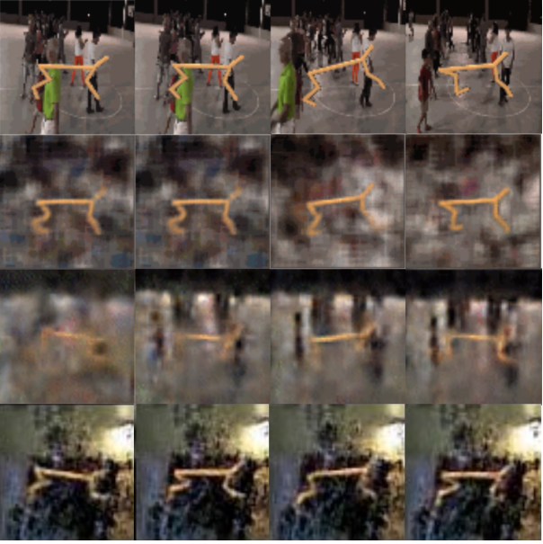
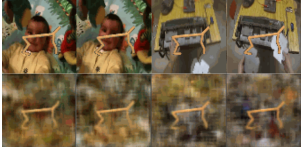
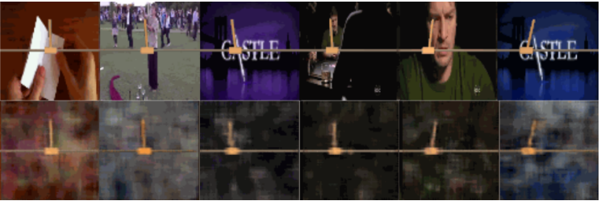
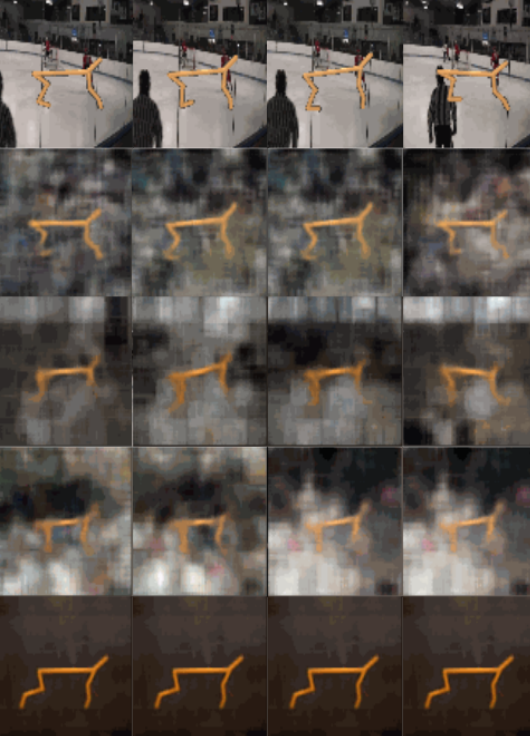

# Learning World Models By Denoising Enviroment Observations

Reproducing Results from the Paper: "Denoised Predictive Imagination: An information-theoretic approach for learning world models". This is done for my RL class, I'll update the changes soon!

***

Humans naturally filter out irrelevant noise and focus on important information to understand and predict how dynamical systems behave over time. For example, when watching a busy scene, we instinctively ignore distractions like background chatter and focus only on what matters. But, reinforcement learning algorithms struggle in similar scenarios. They have difficulty separating meaningful signals from noisy, high-dimensional data, particularly in environments with complex and dynamic noise. And this limitation hampers their ability to make accurate, noise-free predictions. 
***
### Relation to Human Psychology
Predictive Information is maximized by the brain at a higher, more abstract level as a strategy to prevent sensory overload. Imagine a scenario where you’re driving a vehicle and nearing a bend in the road, beyond which visibility is limited. Based on the experience of having faced congested traffic thus far (for say), you may anticipate a similar traffic configuration beyond the bend. In these instances, you mentally simulate future possibilities based on the historical experience and using the current location as a reference point. Notably, during this mental forecast, you instinctively disregard exogenous noise like vehicle’s number plate, cloud formations in the sky, or roadside billboards. This subconscious omission of inconsequential details significantly influences the agent’s decision-making process. While maintaining scholarly modesty, it’s essential to clarify that our contribution in this paper does not constitute an ultimate solution to the challenges described. Instead, our work introduces alternative ideas, traversing similar territory and contributing fresh perspectives to the existing discours
***

## Reconstruction in the natural background setting

Reconstruction. Observation reconstruction of DPI versus Dreamer in the Natural background setting. First row: Ground Truth, Second row: DPI, Third row: Dreamer, Fourth Row: Denoised MDPs.

***

## Reconstruction in blended backgrounds

Reconstruction in blended environments. Observation reconstruction of DPI in the Natural background setting with similar color of agent and the background. First row: Ground Truth, Second row: DPI reconstruction

***

## Reconstruction of Cartpole swingup in random backgrounds

Reconstruction in cartpole environment in random settings. Observation reconstruction of DPI in the Cartpole environment in random background setting. First row: Ground Truth, Second
row: DPI reconstruction

*** 
## Ablation Reconstruction

Evaluating the impact of individual components removal on DPI’s reconstruction on Cheetah Run from DMC Suite. First row: Ground Truth, Second row: DPI, Third row: A, Fourth row: B, Fifth row: C. We have not included D as it does not have the reconstruction.
